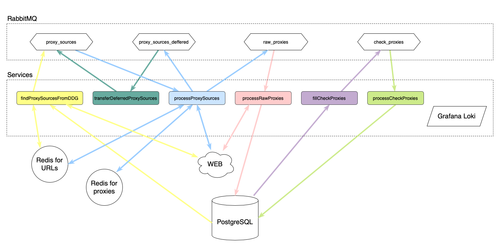

# Proxy-collector

Some services for searching, checking and saving proxies from the WEB.

Found proxies are [here](https://github.com/roma8ok/proxy-list).

## How it works?

1. Start external and proxy-collector services.
2. Get proxies in postgreSQL in table `proxies`. These proxies are fresh because they are checked every 10 minutes.



## Production

1. Start external services:

- rabbitMQ. Add this to advanced.config:

```
[
  {rabbit, [
    {consumer_timeout, undefined}
  ]}
].
```

- redis for collecting sites.
- redis for collecting proxies.
- postgreSQL (within migrations).
- grafana loki / promtail / grafana.

2. Create config file ./config/prod-app.json similar to ./config/develop-app.json.

- In `ip_api_url` you can use `https://public-ip.dev/`, `https://api64.ipify.org/` or other similar services.

3. Start services (in brackets the recommended number of service workers per 1 IP).

- `go build .`
- `./proxy-collector -config=./config/prod-app.json -service=findProxySourcesFromDDG -workers=1` (only 1 worker)
- `./proxy-collector -config=./config/prod-app.json -service=processProxySources -workers=64` (64 <= workers <= 512)
- `./proxy-collector -config=./config/prod-app.json -service=transferDeferredProxySources -workers=1` (only 1 worker)
- `./proxy-collector -config=./config/prod-app.json -service=processRawProxies -workers=512` (512 <= workers <= 1024)
- `./proxy-collector -config=./config/prod-app.json -service=fillCheckProxies -workers=1` (only 1 worker)
- `./proxy-collector -config=./config/prod-app.json -service=processCheckProxies -workers=64` (64 <= workers <= 1024)

## Local development

1. Start external services:

- rabbitMQ:
  `docker run --name proxy-collector-rabbit -d -p 15672:15672 -p 5672:5672 -e RABBITMQ_DEFAULT_USER=admin -e RABBITMQ_DEFAULT_PASS=admin -e RABBITMQ_SERVER_ADDITIONAL_ERL_ARGS="-rabbit consumer_timeout false" rabbitmq:3-management`
- redis for collecting sites:
  `docker run --name proxy-collector-redis-sites -d -p 6379:6379 redis:6`
- redis for collecting proxies:
  `docker run --name proxy-collector-redis-proxies -d -p 6380:6379 redis:6`
- postgreSQL:
    1. `docker run --name proxy-collector-postgres -d -p 5432:5432 -v ${PWD}/migrations:/migrations -e POSTGRES_USER=admin -e POSTGRES_PASSWORD=admin postgres:13`
    2. execute migrations:
       `for f in migrations/*.sql; do; docker exec -t proxy-collector-postgres psql -U admin -d admin -f "/$f"; done`
- grafana loki / promtail / grafana:
    1. `docker run --name proxy-collector-loki -d -v $(pwd)/config:/mnt/config -p 3100:3100 grafana/loki:2.2.1 -config.file=/mnt/config/develop-loki.yaml`
    2. `docker run --name proxy-collector-promtail -d -v $(pwd)/config:/mnt/config -v /var/log:/var/log grafana/promtail:2.2.1 -config.file=/mnt/config/develop-promtail.yaml`
    3. `docker run --name proxy-collector-grafana -d -p 3000:3000 grafana/grafana:latest`
    4. go to http://localhost:3000 (login: `admin`, password: `admin`) and add data source -> Loki -> set url
       to http://localhost:3100 (on macOS - http://docker.for.mac.localhost:3100)

2. Start services (it is necessary to start at least one instance of each service for correct work):

- `go build .`
- `./proxy-collector -config=./config/develop-app.json -service=findProxySourcesFromDDG`
- `./proxy-collector -config=./config/develop-app.json -service=processProxySources`
- `./proxy-collector -config=./config/develop-app.json -service=transferDeferredProxySources`
- `./proxy-collector -config=./config/develop-app.json -service=processRawProxies`
- `./proxy-collector -config=./config/develop-app.json -service=fillCheckProxies`
- `./proxy-collector -config=./config/develop-app.json -service=processCheckProxies`

3. Show rabbitMQ management: http://localhost:15672 (login: `admin`, password: `admin`).

4. Show logs at http://localhost:3000/explore (login: `admin`, password: `admin`), query - `{source="proxy-collector"}`.

5. Show processed proxies - table `proxies` in postgreSQL. User: `admin`, password: `admin`, database: `admin`.
